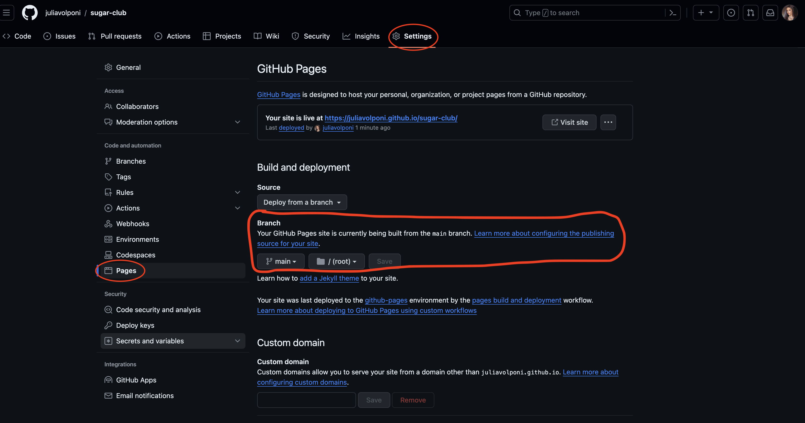

# Healthy Sugar Club

Healthy Sugar Club is a community created to guide people in a healthy life style. The site is targeted to those looking for support. Healthy Sugar Club will be useful to help guide people through the journey of changing an old habit. 

Welcome to Healthy Sugar Club Community [Healthy Sugar Club](https://juliavolponi.github.io/sugar-club/)

# User Experience

## Design Choices
* ### Tipography
  * The font chosen were 'Rajdhani' for the heading and for the body text. It falls back to sans-serif respectively.
* ## Colour Scheme 
  * The colour scheme eventually chosen is based on pink/salmon and off-white. The colour contrasts with the fruits colour in many of the images. Pink traditionally gives the impression of woman, sweet and empowerment. This is something that Healthy Sugar Club can hopefully pass onto the user.

## Features
Healthy Sugar Club is an easy site to use where anyone can feel familiar with each section, making it quick and easy to invite the person to get in contact.
### Existing Features

* ### The Header
* The header presents the name of the club with a picture illustrating the idea of the website. 
* The color chosen to the website is Salmon and white.
* On the right corner on top of the page you find the navigation menu describing the three sections of the website.

* ### About Us Section
* About Us section explains clearly what the purpose of the website is, giving the main information about it.
* It is also described the options of what is given in the community.

* ### Contact Form
* The contact form collect the name, email and the question of the person behind.
* That makes it easier to get back in touch with the answer and making it better the contact between the staff and the member.

* ### Footer
* It is also available to find the club on social medias so the person can have an idea of everything posted and shared.

## Technologies Used
* HTML5 - provides the content and structure for the website.
* CSS - provides the styling.
* Gitpod - used to deploy the website.
* Github - used to host and edit the website.

## Testing 
* I tested this page in different browsers: Chrome, Safari, Firefox.
* I confirm that this project is responsive, looking good on all standard screen sizes checked with the devtools device toolbar.
* The form is working only accepting email on email field, and the submit button gets the information provided.

### Validator Testing
* HTML
* No erros were returned when passing through the official W3C validator
CSS

* No erros were returned when passing through the official(Jigsaw) validator

## Deployment
* The site was deployed to GitHub pages. The steps to deploy are as follows:
   * In the Github Repository, navigate to the Settings tab
   * From the source section drop-down menu, select the Master Branch
   * Once the master branch has been selected, the page provided the link to the completed website.

The live link to the Github repository can be found here: https://juliavolponi.github.io/sugar-club/

## To fork repository on Github
A copy of the GitHub Repository can be made by forking the GitHub account. This copy can be viewed and changes can be made to the copy without affecting the original repository. Take the following steps to fork the repository;

1. Log in to GitHub and locate the repository.
2. In the right hand side of the page inline with the repository name is a button called 'Fork', click on the button to create a copy of the original repository in your GitHub Account.

## To create a local clone of this project
1. Under the repository’s name, click on the code tab.
2. In the Clone with HTTPS section, click on the clipboard icon to copy the given URL.

3. In your IDE of choice, open Git Bash.
Change the current working directory to the location where you want the cloned directory to be made.
4. Type git clone, and then paste the URL copied from GitHub.
5. Press enter and the local clone will be created.

# Credits 
### Content
* The font came from [Google Fonts](https://fonts.google.com/).
* The icons came from [Font Awesome](https://fontawesome.com/).
### Media
* The media came from [Pexels](https://www.pexels.com/search/healthy%20sweet%20food/).

# Acknowledgements
The website was built for my first project of my course from Code Institute. I would like to gratefully thank my mentor Precious Ijege for helping through the steps of this project, he guided me along and helped me in every single step. Would also like to thank the tutors from Code Institute who helped me so much throughout these weeks with every doubt i had. Everyone is so patience and competent. 
Healthy Sugar Club is a fictional community, but i still would encourage everyone to follow this path for a better life.

Julia Volponi 2024.